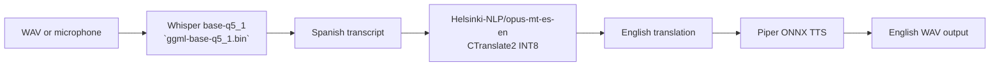

# Edge AI Wearable Audio Translator

An offline Spanish-to-English edge translation pipeline designed for constrained devices. The stack combines a local Whisper speech recognizer, a compact INT8 CTranslate2 machine-translation model, and an offline Piper voice engine so the system can operate without cloud APIs or persistent network access.

## Architecture summary



The operational entry point is `audio_translator/main_translator.py`. The transcriber module is `audio_translator/Transcriber/transcribe_engine.py`, and the translation runtime is `audio_translator/Translator/translate_engine.py` with the generated `audio_translator/Translator/opus-mt-es-en-int8` model directory.

## Repository layout

```text
.
├── .gitignore
├── README.md
├── requirements.txt
├── venv/                                  # root virtual environment
├── audio_translator/
│   ├── main_translator.py                 # end-to-end orchestrator
│   ├── convert_mach_trans.py             # Hugging Face -> CTranslate2 INT8 conversion
│   ├── LICENSE
│   ├── README.md
│   ├── Piper/                            # Piper runtime assets
│   ├── Translator/
│   │   ├── translate_engine.py            # INT8 OPUS translation engine
│   │   └── opus-mt-es-en-int8/           # converted model folder
│   ├── Transcriber/
│   │   ├── transcribe_engine.py          # Whisper CLI wrapper and cleanup logic
│   │   ├── Whisper/
│   │   │   └── whisper-cli.exe            # bundled Whisper runtime
│   │   ├── ggml-base-q5_1.bin            # quantized Whisper base model
│   │   └── test_audio2.wav               # local sample input
│   └── Voices/
│       ├── TTS_Engine.py                 # local Piper wrapping logic
│       └── ...                           # ONNX voice payloads
├── docs/
│   ├── runtime_tracker.md
│   ├── 01_architecture.md
│   ├── 02_diagrams.md
│   ├── 03_pipeline_reference.md
│   └── 04_deployment_and_optimization.md
└── venv/                                  # standard project environment
```

## Fast start

### Prerequisites

- Python 3.9+
- A root-level virtual environment at `venv/`
- Whisper runtime and model payload in `audio_translator/Transcriber/`
- Local CTranslate2 translated model in `audio_translator/Translator/opus-mt-es-en-int8/`
- Piper runtime and voice assets in `audio_translator/Piper/` and `audio_translator/Voices/`
- Memory headroom consistent with a low-power ARM target

### Install dependencies

```powershell
cd C:\path\to\edge_and_optimization_on_wearable_AI_audio_translator
python -m venv venv
.\venv\Scripts\Activate.ps1
python -m pip install --upgrade pip
python -m pip install -r requirements.txt
python -m pip install sacremoses
```

### Run the pipeline

```powershell
python audio_translator/main_translator.py --show-transcript
```

This runs the local pipeline as:

1. STT stage: `audio_translator/Transcriber/transcribe_engine.py`
2. MT stage: `audio_translator/Translator/translate_engine.py`
3. TTS stage: `audio_translator/Voices/TTS_Engine.py`

### Convert the OPUS translation model

```powershell
python audio_translator/convert_mach_trans.py
```

The converter downloads the `Helsinki-NLP/opus-mt-es-en` model and writes the compact `INT8` CTranslate2 output to `audio_translator/Translator/opus-mt-es-en-int8/`.

## Model assets and deployment notes

| Asset | Location | Notes |
|---|---|---|
| Whisper `base-q5_1` | `audio_translator/Transcriber/ggml-base-q5_1.bin` | Quantized STT model, ~85MB |
| Whisper CLI | `audio_translator/Transcriber/Whisper/whisper-cli.exe` | C++ runtime for Windows build |
| INT8 MT | `audio_translator/Translator/opus-mt-es-en-int8/` | Converted with CTranslate2, ~75MB disk, ~55MB RAM |
| Piper voice | `audio_translator/Voices/` | ONNX voice assets, ~60MB disk, ~75MB RAM |
| Optional Alt engine | `.argosmodel` package | Argos Translate remains a modular alternative |

## Documentation

- [Runtime tracker](docs/runtime_tracker.md)
- [System architecture](docs/01_architecture.md)
- [Mermaid diagrams](docs/02_diagrams.md)
- [Pipeline and API reference](docs/03_pipeline_reference.md)
- [Deployment and optimization guide](docs/04_deployment_and_optimization.md)

## License

See [audio_translator/LICENSE](audio_translator/LICENSE).
