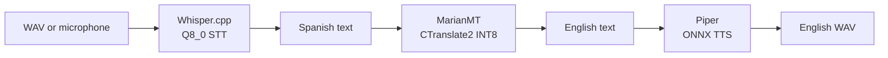

# Edge AI Wearable Audio Translator

An offline Spanish-to-English audio translation prototype for low-power edge hardware. The intended pipeline runs speech recognition, machine translation, and speech synthesis locally, keeping audio and text on the device and avoiding cloud latency and connectivity requirements.

## Architecture



The current repository has a working Whisper subprocess wrapper and an INT8 model conversion utility. `audio_translator/main_translator.py` is still an empty orchestration scaffold, and the checked-in `audio_translator/Piper/` and `audio_translator/Voices/` directories are empty. The detailed documentation describes both the implemented components and the target production integration contract.

## Repository layout

```text
.
├── audio_translator/
│   ├── Transcriber/test_whisper.py       # Whisper CLI wrapper
│   ├── convert_mach_trans.py             # CTranslate2 INT8 conversion
│   ├── main_translator.py                # End-to-end scaffold
│   ├── Piper/                            # Provision Piper here
│   └── Voices/                           # Provision ONNX voice here
├── opus-mt-es-en-int8/                   # Local CTranslate2 model
├── docs/                                 # Architecture and deployment guides
├── requirements.txt
└── README.md
```

## Fast start

### Prerequisites

- Python 3.9 or newer
- A matching Whisper.cpp runtime (`whisper-cli.exe` on the current Windows setup)
- The Whisper model `ggml-tiny-q8_0.bin`
- Piper runtime and an English ONNX voice for TTS
- CPU and memory capacity appropriate for local inference

### Install Python dependencies

Windows PowerShell:

```powershell
python -m venv venv
.\venv\Scripts\Activate.ps1
python -m pip install --upgrade pip
python -m pip install -r requirements.txt
```

Linux:

```bash
python3 -m venv .venv
. .venv/bin/activate
python -m pip install --upgrade pip
python -m pip install -r requirements.txt
```

### Run the implemented STT smoke test

Place `whisper-cli.exe`, its matching DLLs, and `ggml-tiny-q8_0.bin` in `audio_translator/Transcriber/`, then run:

```powershell
python audio_translator/Transcriber/test_whisper.py
```

The current script always uses `audio_translator/Transcriber/test_audio.wav` and does not yet expose CLI arguments. The command prints the Spanish transcript when the bundled Whisper runtime succeeds. This is an STT test, not yet a complete translation run.

### Generate the INT8 translation model

From the repository root, with network access for the initial download:

```powershell
python audio_translator/convert_mach_trans.py
```

The converter downloads `Helsinki-NLP/opus-mt-es-en` and writes a CTranslate2 INT8 model to `opus-mt-es-en-int8/`. The generated directory is ignored by Git, so retain it as a deployment artifact or regenerate it during provisioning.

## Model weights and runtime assets

Provision these assets at the paths expected by the code and target runtime:

| Asset | Required location | Purpose |
|---|---|---|
| `ggml-tiny-q8_0.bin` | `audio_translator/Transcriber/` | Quantized Spanish STT |
| `whisper-cli.exe` and matching DLLs | `audio_translator/Transcriber/` | Whisper.cpp execution on Windows |
| `model.bin`, `config.json`, vocabulary | `opus-mt-es-en-int8/` | CTranslate2 INT8 Spanish-to-English MT |
| Piper executable/runtime | `audio_translator/Piper/` | Offline TTS execution |
| `en_US-ryan-low.onnx` and `.json` | `audio_translator/Voices/` | English Piper voice |

Large model and binary assets are excluded by `.gitignore`. Record their versions and checksums in a release manifest before deploying to a device.

## Documentation

- [Runtime tracker](docs/runtime_tracker.md)
- [System architecture](docs/01_architecture.md)
- [Mermaid diagrams](docs/02_diagrams.md)
- [Pipeline and API reference](docs/03_pipeline_reference.md)
- [Deployment and optimization guide](docs/04_deployment_and_optimization.md)

## License

See [audio_translator/LICENSE](audio_translator/LICENSE).
