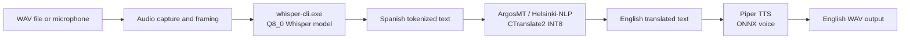
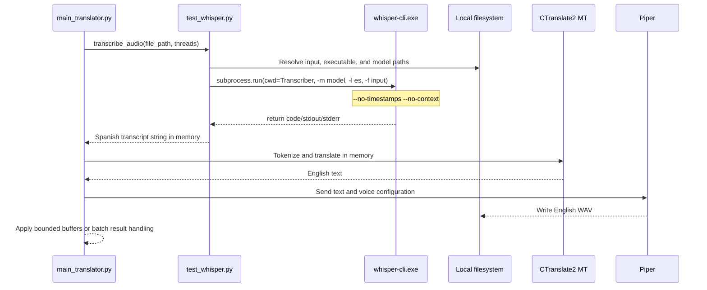
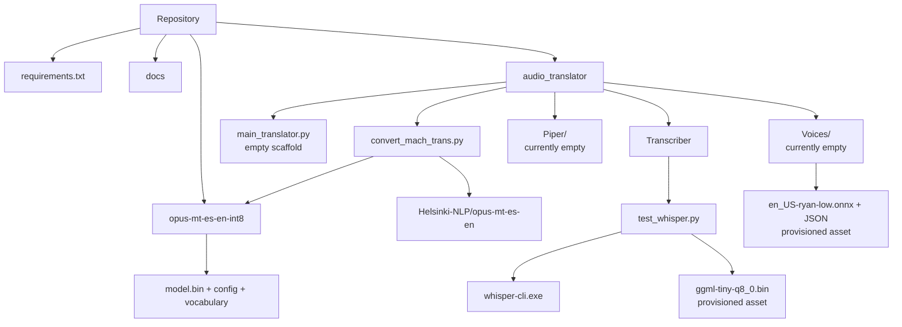

# Visual System Diagrams

The diagrams use Mermaid syntax and can be rendered by GitHub, VS Code Markdown preview, or a Mermaid-compatible documentation site.

## End-to-end pipeline

## Process sequence

The current repository implements the STT sequence only. The MT and TTS calls are the integration contract for the pending orchestrator.

## Module relationship

