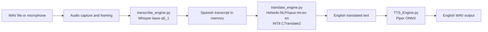
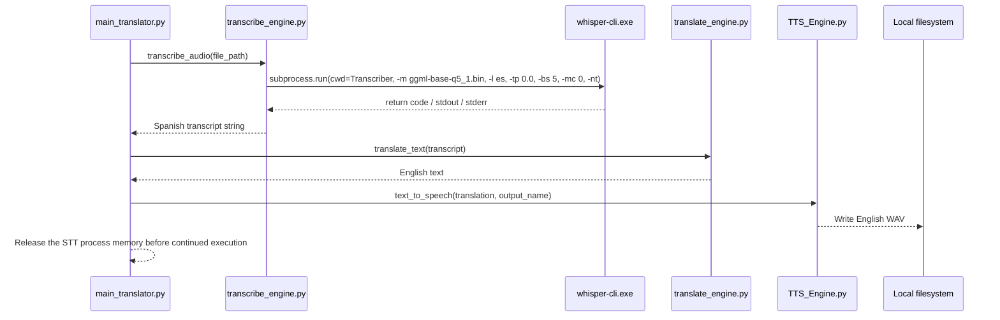
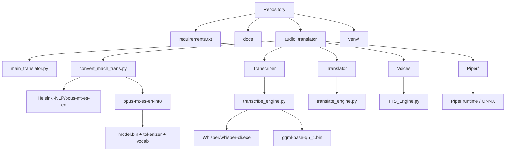

# Visual System Diagrams

The diagrams use Mermaid syntax and reflect the current project modules and the finalized edge pipeline.

## End-to-end pipeline

## Process sequence

The STT subprocess is intentionally isolated so its RAM can be released before the MT and TTS stages begin, which reduces maximum memory pressure on the board.

## Module relationship

